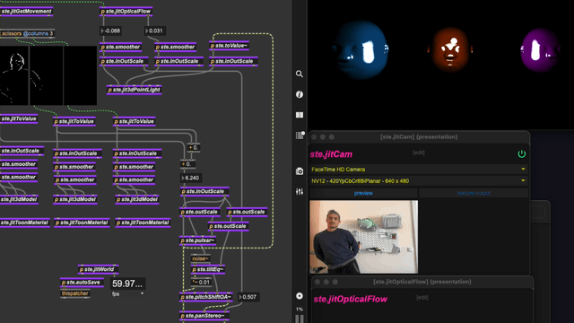

# ste.snips

## dependencies

After installing the package go to the extras menu and open the ste.snips.overview, here you find a list of the packages needed for some snippets to run.
The package already includes a collection of media pipe projects from [lysdexic-audio github](https://github.com/lysdexic-audio): face-landmarker, facemesh, hands-gesture-recognizer, hands-landmarker,object-detection, pose-landmarker. If you already have these installed in your Max library, you'll need take care about possible conflicts and decide which ones to keep.

## Intro

ste.snips is a package for Max9, consisting of a collection of snippets designed to expedite and simplify your Max experience, with a focus on embodied interactivity and real-time audio-visual synergy.

Find some videos of patches built with the ste.snippets here:
- [shaking my heads](https://www.youtube.com/watch?v=TAmbGvDeVtY)
- [duckFace improvisation](https://www.youtube.com/watch?v=dOpI2ajVjL0)
- [Amen hand-break](https://www.youtube.com/watch?v=CH11DIMfMSY)

The primary goal of the ste.snips collection is to provide quick access and powerful tools for beginners who have never used Max and are unfamiliar with programming or Max-specific idioms, while also speeding up patching for seasoned users.

Most snippets are single subpatchers that, when opened, display a ready-to-use interface in a separate window located at the bottom right of your main monitor. This allows quick access to the interface for each specific snippet while maintaining a minimal and clean main patch.

Some snippets are more complex, while others are simple wrappers designed to offer a consistent user experience, especially for students. Credits for code contributions from [C74](https://cycling74.com/) and others can be found within the snippets and their descriptions.

## For Seasoned Max Users

I created these tools for my courses at art universities, prioritizing simplicity and ease of use over efficiency, precise terminology, and technical correctness. Most snippets dealing with timed events are synchronized with jit.world and are not sample-accurate.

All UI parameters within the snippets have specific scripting names, are pattr addressable, and automatically save their values when the patch is saved using the [ste.autosave] snippet.

Why Snippets and Not Abstractions?
I value long-term compatibility but also want the flexibility to improve my snippets without issues with old project. Snippets allow me to update and modify them without breaking old patches that rely on them.

## Special Thanks

To my students at the [Univ. of Applied Arts Vienna](https://dieangewandte.at/) ([APL](https://apl.uni-ak.ac.at/)) ([DK](https://digitalekunst.ac.at/)), [Kunst Uni. Linz](https://www.kunstuni-linz.at/) ([interface cultures](https://www.kunstuni-linz.at/en/studies/degree-programmes/interface-cultures/master-programme)) and [FH Salzburg](https://www.fh-salzburg.ac.at/) for testing the snippets over the years while working on their projects

To everyone whose code or patches are included in this snippet collection.

To [Klaus Obermaier](https://www.exile.at/) for introducing me to Max in 2009, teaching me about interactivity, and influencing many of the methods used in these snippets.

to Vienna's [MA7](https://www.wien.gv.at/kultur/abteilung/) for the support.

## latest changelogs
#### v0.0.6
- shiny new stuff
	- ste.folderPath is a snippets that checks the path of the patch and adds it to the Max search path. This will make the file path of the media you drop in snippets more readable, when stored near the patch
- changes and improvements
	- meshwarp comment ste.scenes (normally there is no state save and "read" message does not work)
	- all snippets have no background panel anymore, they are now editable or lockable with cmd/ctrl-click
	- "open description" button renamed to "?" in all snippets
	- then "enable" or "on/off" button now uses an other text character, hopefully windows friendly
	- ste.pixVideoLoop: resetLoop gets triggered when loading a new video
	- ste.getPitch: last out renamed to "pitch (Hz) (sig~)"
	- ste.granular~ has now a 3rd output: sampleLenght (ms)

#### v0.0.5

- shiny new stuff
	- new exemple: strudelPlay
	- new example: audioPlayerExample.maxpat
	- ste.getPitch~ for pitch detection 
	- ported from dataknow package:
		- ste.audioHitClassifier~
		- ste.audioClassifier~
		- ste.getDescriptors~
- changes and improvements
	- ste.sequence
		- sequence step now excluded from preset
		- smooth preset interpolation now works
	- ste.videoTrig
		- now uses startMs instead of startPos (milliseconds instead of position) to indicate where to start the playback from
		- uses loop 3 and loopoints_ms instead of delay and stop. It should be more precise when triggering long video fragments
	- ste.3dCornerpin
		- now it is possible to smoothly transition between presets without video flicker
	- ste.3dWorld
		- the 4th inlet is now correctly named "clear"
	- ste.3dMotion
		- all internal params are now addressable from outside
	- ste.kick
		- works without Percolate installed
		- new "distort" parameter
	- ste.loudness3
		- each filter has now its own amp param
	- ste.snips now depend also on flucoma and dataknow packages
